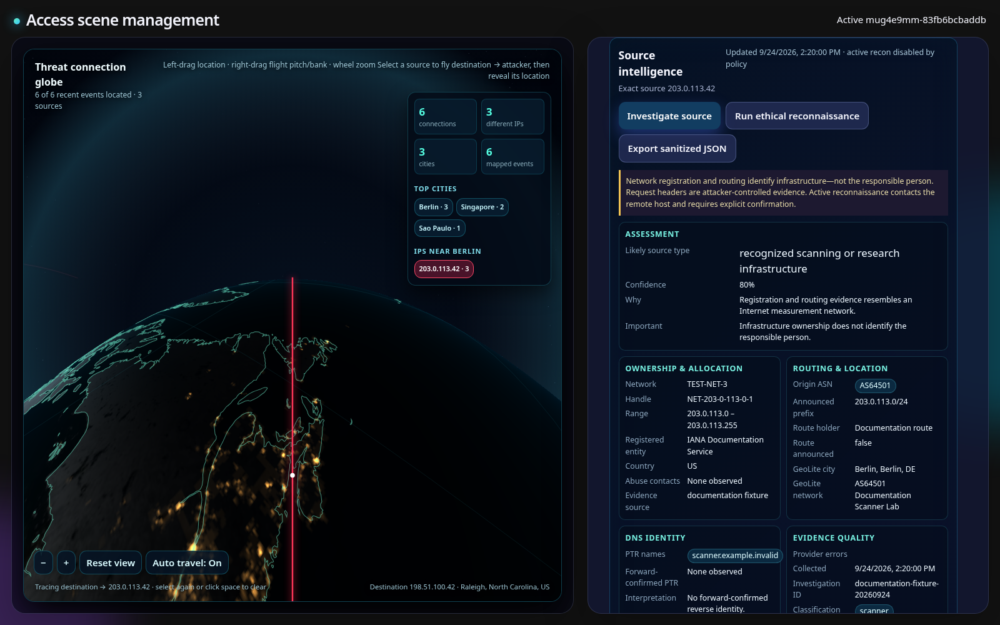
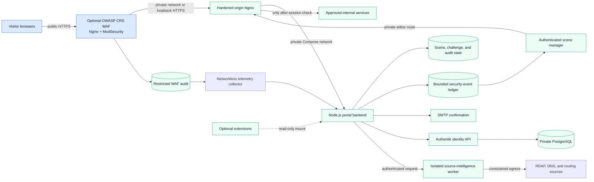

# Scene Access Gateway

[](https://github.com/zipkindev/scene-access-gateway/actions/workflows/ci.yml)
[](LICENSE)
[](docs/deployment/README.md)
[](authentik/README.md)
[](https://github.com/zipkindev/scene-access-platform)

A self-hosted, scene-driven access portal that combines an interactive visual
gateway, a browser-based scene editor, destination-specific access workflows,
and Authentik identity management in a portable Docker Compose stack.

For the complete tested Gateway + Wolf3D/Spear workspace, start with
[Scene Access Platform](https://github.com/zipkindev/scene-access-platform).
This repository remains the independently buildable core application and the
correct place to develop portal, backend, Scene Management, identity, artwork,
and security-monitoring features.


_The Future table is one of the project-generated interactive scenes. Artwork
is versioned, checksummed, and licensed separately from the application code._

## Why this project exists

Most access gateways begin and end with a login form. Scene Access Gateway
turns that boundary into an authored visual experience: visitors explore a
responsive scene, activate destination hotspots, complete a QR/email access
flow, and continue to the selected service. Administrators can compose and
publish those scenes without rebuilding the application.

The project also serves as a practical reference for decomposing a mature,
working application into reproducible containers while preserving its
security boundaries and behavior.

## Product tour

### Author scenes and hidden interactions

Scene Management is a browser-based authoring workspace, not a collection of
hard-coded image maps. An administrator can choose and optimize artwork,
define TV and phone framing, place destination hotspots, require an ordered
sequence of up to ten clicks, preview the QR position, save drafts, publish, and
restore earlier revisions. A per-scene click debugger can temporarily show
browser-to-server click receipts for troubleshooting; it is off by default and
does not change the hotspot sequence.


The numbered rings are editor-only controls. Public visitors see the artwork,
not the location of its access triggers.

### Turn exploration into a short-lived QR handoff


This clip uses a disposable local Compose stack. Its QR pointed only to
`localhost`, expired with the demo, and cannot authorize any deployed service.
The visible pointer and step label are documentation overlays; the QR reveal
and challenge are the real application flow.

### Review access and security signals in the same workspace


The protected console correlates portal visits, QR activity, email-delivery
outcomes, access requests, session creation, unknown routes, rate limiting,
and common probe indicators. The screenshot uses the documentation-only IP
`203.0.113.42`; it contains no production hostname, account, or visitor data.
Optional GeoLite2 enrichment runs locally so visitor IPs are not sent to a
lookup service. Operators can combine removable severity, event-category,
country, exact-IP, and CIDR filters; detected locations appear beside the
source address. MaxMind onboarding, database downloads, update status, and
credential removal are managed from the same protected console. See
[security monitoring](docs/security-monitoring.md).



Selecting a source can open a passive assessment combining ledger evidence,
local GeoIP, RDAP ownership, reverse DNS, and routing context. The unexposed
worker has no portal-state mount and active checks remain disabled by default.

## Highlights

- **Interactive portal:** zoomable and pannable scenes, motion layers,
  destination hotspots, QR challenges, responsive layouts, reduced-motion
  support, and optional scene interactions.
- **Visual scene editor:** background and image management, framing profiles,
  hotspot placement, ordered unlock sequences, scene-specific browser titles,
  opt-in click diagnostics, previews, drafts, publishing, and revision history.
- **Arcade continuity:** resumable local play, persistent ranked scoreboards
  across thirteen game profiles, guarded score submission, and extension-side
  Wolf/Spear competition contracts.
- **Identity integration:** narrowly scoped Authentik lookups and management
  operations, email verification, destination membership, and signed portal
  assertions.
- **Security visibility:** a protected, retention-bounded event console for QR
  outcomes, access requests, source IPs, offline GeoIP/ASN context, rate limits,
  composable source/location/category filters, non-blocking scanner/injection
  probe indicators, and optional redacted Telegram alerts with complete bot
  onboarding in Scene Management.
- **Container isolation:** the selected Nginx edge is the only public
  entrypoint. With the WAF enabled, the origin gateway, Node.js backend, and
  identity services remain on private Compose networks.
- **Defense in depth:** an optional tracked OWASP CRS 4.29.0/ModSecurity 3.0.16
  WAF can precede the hardened origin Nginx. The portable edge rejects common
  secret-file probes, strips management trust headers, hides management
  routes, normalizes security logs, bounds slow requests, compresses text
  responses, and applies browser isolation headers in addition to any
  deployment WAF.
- **Reproducible delivery:** digest-pinned base images, exact artwork and
  optional-audio checksums, deterministic public asset archives, host tests,
  and isolated Compose smoke tests.
- **Portable deployment:** local Compose, an optional Authentik/PostgreSQL
  overlay, image export/import for air-gapped hosts, and a separately reviewed
  TrueNAS deployment boundary.
- **Extension contract:** optional experiences such as the GPL-3.0
  [Wolf3D/Spear extension](https://github.com/zipkindev/scene-access-gateway-wolf3d)
  attach without adding proprietary game data to this repository.

## Architecture



The portable default exposes only loopback development listeners. The optional
[WAF deployment component](deploy/waf/README.md) supplies the reusable image,
templates, observation policy, and hardened Compose pattern. Production TLS,
hostnames, editor authentication, audit storage, and network policy remain
reviewed deployment configuration rather than image content.

In the deployed topology, `access-waf` is Nginx with the ModSecurity 3.0.16
module loaded; OWASP CRS 4.29.0 is the ruleset evaluated by that module. They
are layers of one WAF service, not separate WAF containers. The private
`access-proxy` remains a distinct hardened origin, while `access-portal`
provides the application and Scene Management. Two certificate reloaders cover
the public and origin Nginx processes. A sixth, networkless `waf-telemetry`
service continuously reads the raw audit mount read-only and writes only
bounded normalized findings for the portal to ingest. The seventh,
`source-intelligence`, is an unexposed token-authenticated helper with narrow
egress for passive RDAP, reverse-DNS, and routing evidence; active checks are
disabled unless the operator explicitly enables and confirms them.

The normalizer removes headers, bodies, query values, cookies, authorization
data, and uploads. Transaction identifiers that do not meet the ledger's
bounded identifier syntax are converted to stable SHA-256-derived correlation
IDs. A first scan marks existing audit files historical: those records remain
available for investigation but do not create Telegram notifications. Live
requests also produce a minimal, query-free Nginx correlation record with the
shared transaction ID, sanitized path, final client status, and upstream
status. The networkless collector joins it to the audit before ingestion. If
the access record arrives later, an integrity-protected outcome correction is
folded into the original finding, so the UI, CSV, and Telegram expose one
unified request rather than duplicate events. Live findings are also grouped
by source, target, and category; duplicate events are
aggregated and sustained incidents can produce bounded reminders according to
the Scene Management policy.

Finding severity is derived from the matched CRS rule severity and
high-confidence attack category, not from a response code. In the UI and
Telegram, audit status is labeled `WAF audit HTTP` while automatic edge
correlation is pending. Once joined, `Final HTTP` is the client response,
`audit phase HTTP` remains separate evidence, and upstream reachability is
explicit. A non-interrupted audit
`2xx` does not prove that the client received a success response,
authenticated, reached an administrative function, or exploited the
application. The event model reports detection, enforcement, and origin
reachability separately. A WAF interruption is recorded as `WAF blocked`; the
numeric-Host default-server contract is recorded as `Edge HTTP 444`, `edge
policy rejected`, and `origin not reached`; other DetectionOnly findings remain
`final outcome unverified` only while correlation is pending. The audit-phase status is retained
separately for diagnosis. Normalized findings include a safe CRS rule
explanation plus the sanitized method, path, result provenance, action, and WAF
mode without retaining request headers, query values, or bodies.

Path-aware presentation distinguishes remote-service enumeration from generic
protocol anomalies. Recognized Microsoft RDP Web, Exchange/OWA, SonicWall,
Ivanti/Pulse Secure, Windows remote-management, and VPN-gateway probes are
grouped as `service_enumeration`; credential/configuration files, backup files,
and framework administration endpoints keep their own categories and severity.
This classification describes attacker behavior, not proof that the named
product exists on the origin.

Scene Management can export the current Security Monitoring view as CSV. The
export uses the active time range and every active filter and includes only
sanitized ledger fields. Separate columns identify the final/status-source
result, audit-phase status, enforcement disposition, CRS rules, behavior
summary, and whether the origin was reached. Spreadsheet formula prefixes are
neutralized on export.

Start an internet-facing rollout with `MODSEC_RULE_ENGINE=DetectionOnly` and
retain application/origin enforcement. Use a one-week observation window to
compare WAF findings with origin outcomes, rate limits, and known legitimate
flows. Enable high-confidence CRS protections incrementally only after that
review; the mode remains deployment-controlled rather than changeable from the
browser.

Deployments that serve additional public names declare them explicitly with
`SAG_PUBLIC_HOST_ALIASES`; for example, the arcade hostname can share the
portal without becoming a wildcard trust rule. The backend accepts only the
canonical hostname and configured aliases on the canonical origin port or the
default external TLS port. WAF and origin Nginx allowlists must contain the
same names, while unknown hosts, arbitrary ports, credentials, and path-shaped
Host values continue to fail closed.

More detail is available in the [architecture notes](docs/architecture/README.md).

Every protected application is declared in
[`deploy/applications.json`](deploy/applications.json). The contract makes its
route/host mode, private origin variables, Authentik and QR behavior, proxy
rules, external CSP sources, WAF policy, exception rationale, and acceptance
journeys reviewable together. `scripts/check-application-contracts.js` fails
closed on wildcard or undocumented exceptions and runs as part of the normal
test gate.

The public Platform repository pins a tested Gateway commit together with a
tested optional Wolf extension commit. It does not copy this repository's
source or absorb its Apache-2.0 history.

## How an access handoff works

A handoff carries an approval from the visitor's phone back to the browser
showing the scene. The private application opens on that display, not on the
phone.

**Display → QR code → phone → confirmation email → display → private application**

### If the visitor already has access

1. The visitor selects a private application on the display. After the scene's
   configured interaction finishes, a QR code appears.
2. The visitor scans the code with their phone and enters their username or
   email address.
3. The gateway checks that the account is allowed to use the selected
   application. It sends a one-time link to the email address already recorded
   for that account.
4. The visitor opens the email link. This approves the waiting display; it does
   not open the private application on the phone.
5. The display notices the approval and opens only the selected application.

### If the visitor does not have access yet

The visitor can submit an access request for that specific application. The
request waits in Scene Management for an owner to review. Submitting the
request does not grant access. After an owner approves it and grants the
required membership, the visitor starts again with a new QR code.

Firewall access also requires a separate, one-time owner confirmation before
membership is granted.

### What stays private

The QR code, email link and browser approval are short-lived and limited to the
selected application. Public browsers never receive internal API credentials,
private service addresses or the portal signing key. The gateway checks the
approval and forwards only the authorized request.

## Repository layout

| Path | Responsibility |
| --- | --- |
| `frontend/` | Nginx gateway, general scene artwork, and asset manifests |
| `backend/` | Portal APIs, sessions, destinations, mail, persistence, and scene editor |
| `authentik/` | Blueprints, templates, and identity-integration guidance |
| `deploy/` | Portable and environment-specific deployment material |
| `scripts/` | Bootstrap, validation, build, test, packaging, and image-transfer tools |
| `docs/` | Architecture, configuration, deployment, extension, and release records |

## Quick start

### Requirements

- Git
- Docker Engine
- Docker Compose v2
- Node.js 22 or newer only for running tests directly on the host

### Build and run

For the complete supported workspace:

```sh
git clone --recurse-submodules https://github.com/zipkindev/scene-access-platform.git
cd scene-access-platform
./scripts/test.sh
./scripts/up.sh
```

For standalone Gateway development:

```sh
git clone https://github.com/zipkindev/scene-access-gateway.git
cd scene-access-gateway

./scripts/check-prerequisites.sh
./scripts/bootstrap.sh
./scripts/test.sh
./scripts/build.sh
./scripts/smoke-test.sh
./scripts/up.sh
```

The development endpoints bind to loopback:

| Endpoint | Default URL | Purpose |
| --- | --- | --- |
| Portal | <http://localhost:8080> | Public scene and access flow |
| Editor | <http://localhost:8081> | Local development editor gateway |

Review the generated `.env` before starting services. Stop the stack with
`./scripts/down.sh`.

## Optional Authentik stack

The base stack does not require identity credentials simply to display the
local portal and editor. To add the included Authentik/PostgreSQL services:

```sh
./scripts/init-secrets.sh
docker compose -f compose.yaml -f compose.authentik.yaml config
docker compose -f compose.yaml -f compose.authentik.yaml up -d
```

Read the [configuration guide](docs/configuration/README.md) and
[Authentik notes](authentik/README.md) before enabling live account or email
operations. Secrets belong under `.local/` or another protected host path and
must never be committed.

## Optional Wolf3D/Spear extension

The game integration is deliberately maintained in a separate GPL-3.0
repository. The recommended setup is the Platform workspace above, where
`gateway/` and `wolf3d/` are pinned submodules and the root scripts assemble
their Compose files.

Component contributors can also combine standalone checkouts:

```sh
git clone https://github.com/zipkindev/scene-access-gateway-wolf3d.git ../scene-access-gateway-wolf3d
export SAG_WOLF3D_EXTENSION_DIR="$(cd ../scene-access-gateway-wolf3d && pwd)"

docker compose \
  -f compose.yaml \
  -f "$SAG_WOLF3D_EXTENSION_DIR/compose.extension.yaml" \
  up -d --build
```

Users must import their own legally obtained, supported game data. Nothing in
the main repository requires the extension; without it, the portal and editor
remain fully usable. See the [extension guide](docs/extensions/wolf3d.md).

## Reproducible assets and builds

`scripts/build.sh` verifies every tracked artwork checksum, the optional
Future-table audio manifest and playback boundaries, and the digest-pinned
Node/Nginx bases before Compose builds either image. The public artwork bundle
can be recreated with:

```sh
./scripts/package-scene-assets.sh
```

The archive is deterministic and checked against
`manifests/scene-assets-release.json`. Raw Pixabay MP3s are intentionally not
distributed through Git. An authorized local set can be installed with
`./scripts/import-audio.sh .local/audio-source`. See
[reproducible builds](docs/deployment/reproducible-builds.md) for details.

## Deployment options

- **Portable Compose:** build and launch the frontend/backend stack directly.
- **Identity overlay:** add Authentik, its worker, and PostgreSQL.
- **Registry or air-gapped host:** use `scripts/export-images.sh` and
  `scripts/load-images.sh`, then verify the printed SHA-256 out of band.
- **TrueNAS:** combine the portable stack with an ignored, reviewed local
  override based on `deploy/truenas/`; production topology is not tracked.

See the [deployment guide](docs/deployment/README.md).

## Security model

- The backend is not published directly by Compose.
- Containers use read-only filesystems where practical, drop Linux
  capabilities, and enable `no-new-privileges`.
- Editor, Authentik management, PostgreSQL, secrets, and persistent state are
  expected to remain behind authenticated private boundaries.
- Local editor identity injection is a development convenience, not a
  production authentication design.
- Security-sensitive deployment changes require route, denial, secret-mount,
  rollback, and recovery validation.
- The security ledger stores normalized routes, outcomes, source IPs, and
  keyed fingerprints; it excludes request bodies, query strings, QR/session
  tokens, passwords, and raw email identities.
- Probe classifications are investigation signals, not claims that an exploit
  succeeded. Edge access logs, Authentik events, and a reviewed WAF or
  remediation layer remain separate controls.
- Public ingress must not route `/internal/torrentharbor-management/`. Trusted
  management callers connect over the private network and are checked against
  their TCP peer address; internet-supplied identity or source headers are not
  authorization.
- Frontend logs contain normalized routes rather than raw query strings or
  one-time tokens. Versioned scripts receive immutable caching, while Nginx
  compresses eligible text responses and enforces connection/body timeouts.

Please read [SECURITY.md](SECURITY.md) before reporting a vulnerability or
deploying the gateway publicly.

## Project status

The repository contains the canonical source, separated frontend and backend
images, portable Compose definitions, exact asset manifests, and documented
behavioral parity gates. Its portable code is synchronized with the reusable
behavior of verified release 78, while production topology and local licensed
content remain excluded. Local builds and smoke tests pass. A production
replacement is intentionally gated on the remaining items in the
[release checklist](docs/RELEASE-CHECKLIST.md) and the
[production parity record](docs/migration/production-parity.md).

For ongoing work, follow the
[local development and Git synchronization guide](docs/maintenance/local-development.md).

## Contributing

Run `./scripts/test.sh` and `./scripts/build.sh` before submitting changes.
Asset contributions must include provenance and redistribution terms. See
[CONTRIBUTING.md](CONTRIBUTING.md) for the contribution and licensing rules.

## License and asset rights

- Software, configuration, scripts, and documentation: [Apache-2.0](LICENSE)
- Project-generated artwork: [CC BY 4.0](frontend/artwork/LICENSE.md)
- Optional locally supplied third-party audio: Pixabay Content License, with
  [per-file sources and hashes](frontend/artwork/SOURCES.md); raw files are not
  distributed through this repository
- Optional Wolf3D/Spear extension: GPL-3.0 in its separate repository

See [NOTICE](NOTICE) for the complete repository boundary. Commercial game
data, local credentials, uploaded production content, and active runtime state
are not part of this repository.
