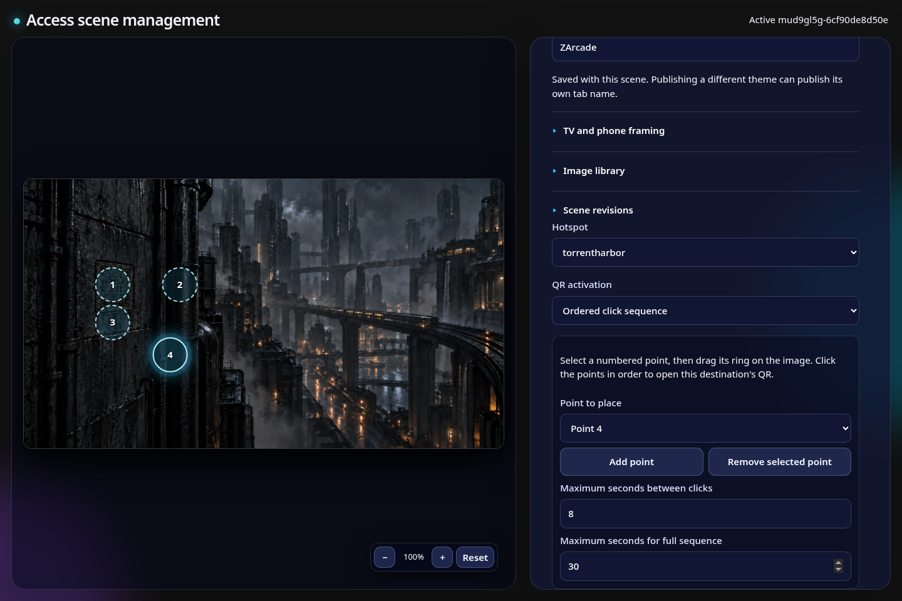
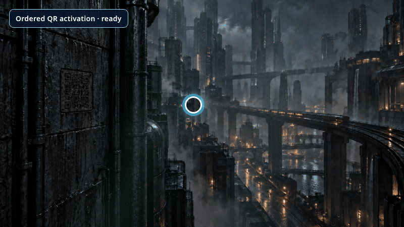
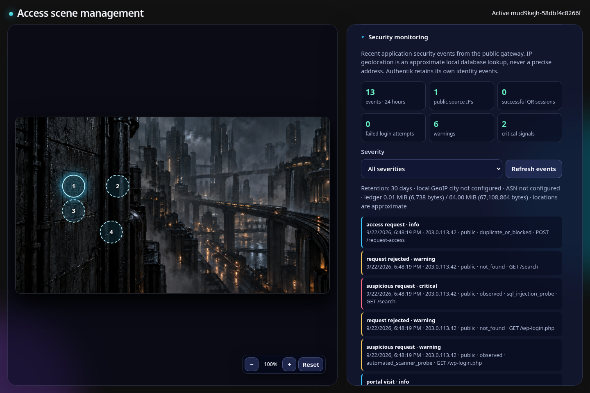
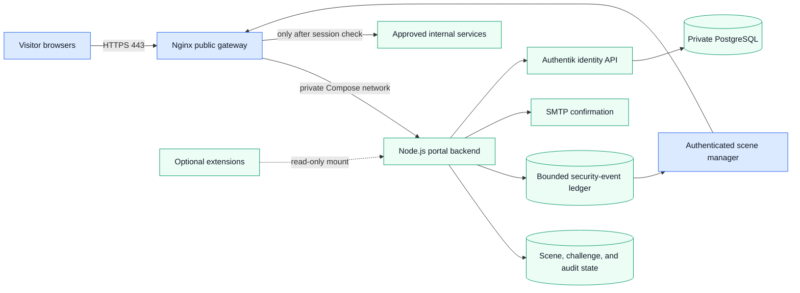
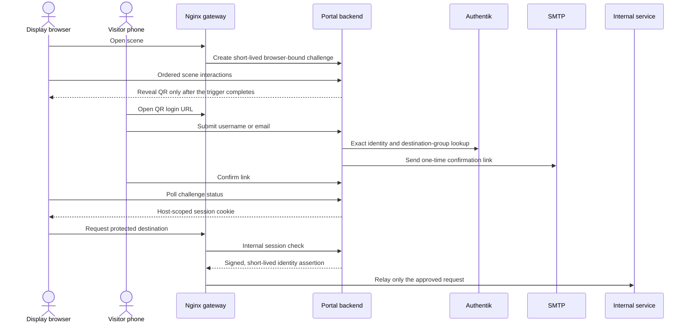

# Scene Access Gateway

[](https://github.com/zipkindev/scene-access-gateway/actions/workflows/ci.yml)
[](LICENSE)
[](docs/deployment/README.md)
[](authentik/README.md)

A self-hosted, scene-driven access portal that combines an interactive visual
gateway, a browser-based scene editor, destination-specific access workflows,
and Authentik identity management in a portable Docker Compose stack.


_The Future table is one of the project-generated interactive scenes. Artwork
is versioned, checksummed, and licensed separately from the application code._

## Why this project exists

Most access gateways begin and end with a login form. Scene Access Gateway
turns that boundary into an authored visual experience: visitors explore a
responsive scene, activate destination hotspots, complete a QR/email access
flow, and continue to the selected service. Administrators can compose and
publish those scenes without rebuilding the application.

The project also serves as a practical reference for decomposing a mature,
working application into reproducible containers while preserving its
security boundaries and behavior.

## Product tour

### Author scenes and hidden interactions

Scene Management is a browser-based authoring workspace, not a collection of
hard-coded image maps. An administrator can choose and optimize artwork,
define TV and phone framing, place destination hotspots, require an ordered
sequence of up to ten clicks, preview the QR position, save drafts, publish, and
restore earlier revisions.



The numbered rings are editor-only controls. Public visitors see the artwork,
not the location of its access triggers.

### Turn exploration into a short-lived QR handoff



This clip uses a disposable local Compose stack. Its QR pointed only to
`localhost`, expired with the demo, and cannot authorize any deployed service.
The visible pointer and step label are documentation overlays; the QR reveal
and challenge are the real application flow.

### Review access and security signals in the same workspace



The protected console correlates portal visits, QR activity, email-delivery
outcomes, access requests, session creation, unknown routes, rate limiting,
and common probe indicators. The screenshot uses the documentation-only IP
`203.0.113.42`; it contains no production hostname, account, or visitor data.
Optional GeoLite2 enrichment runs locally so visitor IPs are not sent to a
lookup service. See [security monitoring](docs/security-monitoring.md).

## Highlights

- **Interactive portal:** zoomable and pannable scenes, motion layers,
  destination hotspots, QR challenges, responsive layouts, reduced-motion
  support, and optional scene interactions.
- **Visual scene editor:** background and image management, framing profiles,
  hotspot placement, ordered unlock sequences, scene-specific browser titles,
  previews, drafts, publishing, and revision history.
- **Arcade continuity:** resumable local play, persistent ranked scoreboards
  across thirteen game profiles, guarded score submission, and extension-side
  Wolf/Spear competition contracts.
- **Identity integration:** narrowly scoped Authentik lookups and management
  operations, email verification, destination membership, and signed portal
  assertions.
- **Security visibility:** a protected, retention-bounded event console for QR
  outcomes, access requests, source IPs, offline GeoIP/ASN context, rate limits,
  and non-blocking scanner/injection probe indicators.
- **Container isolation:** an Nginx gateway is the only public entrypoint; the
  Node.js backend and identity services remain on private Compose networks.
- **Reproducible delivery:** digest-pinned base images, exact artwork and
  optional-audio checksums, deterministic public asset archives, host tests,
  and isolated Compose smoke tests.
- **Portable deployment:** local Compose, an optional Authentik/PostgreSQL
  overlay, image export/import for air-gapped hosts, and a separately reviewed
  TrueNAS deployment boundary.
- **Extension contract:** optional experiences such as the GPL-3.0
  [Wolf3D/Spear extension](https://github.com/zipkindev/scene-access-gateway-wolf3d)
  attach without adding proprietary game data to this repository.

## Architecture



The portable default exposes only loopback development listeners. Production
TLS, hostnames, editor authentication, and network policy belong in reviewed
deployment configuration rather than the application image.

More detail is available in the [architecture notes](docs/architecture/README.md).

## How an access handoff works



Known destination members receive an automated one-time email confirmation.
Unknown visitors can submit an access request, which enters a durable
destination-specific review queue in Scene Management. Firewall enrollment has
an additional owner-confirmation step before group membership is granted.
Public clients never receive internal API credentials, upstream addresses, or
the portal signing key.

## Repository layout

| Path | Responsibility |
| --- | --- |
| `frontend/` | Nginx gateway, general scene artwork, and asset manifests |
| `backend/` | Portal APIs, sessions, destinations, mail, persistence, and scene editor |
| `authentik/` | Blueprints, templates, and identity-integration guidance |
| `deploy/` | Portable and environment-specific deployment material |
| `scripts/` | Bootstrap, validation, build, test, packaging, and image-transfer tools |
| `docs/` | Architecture, configuration, deployment, extension, and release records |

## Quick start

### Requirements

- Git
- Docker Engine
- Docker Compose v2
- Node.js 22 or newer only for running tests directly on the host

### Build and run

```sh
git clone https://github.com/zipkindev/scene-access-gateway.git
cd scene-access-gateway

./scripts/check-prerequisites.sh
./scripts/bootstrap.sh
./scripts/test.sh
./scripts/build.sh
./scripts/smoke-test.sh
./scripts/up.sh
```

The development endpoints bind to loopback:

| Endpoint | Default URL | Purpose |
| --- | --- | --- |
| Portal | <http://localhost:8080> | Public scene and access flow |
| Editor | <http://localhost:8081> | Local development editor gateway |

Review the generated `.env` before starting services. Stop the stack with
`./scripts/down.sh`.

## Optional Authentik stack

The base stack does not require identity credentials simply to display the
local portal and editor. To add the included Authentik/PostgreSQL services:

```sh
./scripts/init-secrets.sh
docker compose -f compose.yaml -f compose.authentik.yaml config
docker compose -f compose.yaml -f compose.authentik.yaml up -d
```

Read the [configuration guide](docs/configuration/README.md) and
[Authentik notes](authentik/README.md) before enabling live account or email
operations. Secrets belong under `.local/` or another protected host path and
must never be committed.

## Optional Wolf3D/Spear extension

The game integration is deliberately maintained in a separate GPL-3.0
repository. With both repositories checked out beside one another:

```sh
git clone https://github.com/zipkindev/scene-access-gateway-wolf3d.git
export SAG_WOLF3D_EXTENSION_DIR="$(cd ../scene-access-gateway-wolf3d && pwd)"

docker compose \
  -f compose.yaml \
  -f "$SAG_WOLF3D_EXTENSION_DIR/compose.extension.yaml" \
  up -d --build
```

Users must import their own legally obtained, supported game data. Nothing in
the main repository requires the extension; without it, the portal and editor
remain fully usable. See the [extension guide](docs/extensions/wolf3d.md).

## Reproducible assets and builds

`scripts/build.sh` verifies every tracked artwork checksum, the optional
Future-table audio manifest and playback boundaries, and the digest-pinned
Node/Nginx bases before Compose builds either image. The public artwork bundle
can be recreated with:

```sh
./scripts/package-scene-assets.sh
```

The archive is deterministic and checked against
`manifests/scene-assets-release.json`. Raw Pixabay MP3s are intentionally not
distributed through Git. An authorized local set can be installed with
`./scripts/import-audio.sh .local/audio-source`. See
[reproducible builds](docs/deployment/reproducible-builds.md) for details.

## Deployment options

- **Portable Compose:** build and launch the frontend/backend stack directly.
- **Identity overlay:** add Authentik, its worker, and PostgreSQL.
- **Registry or air-gapped host:** use `scripts/export-images.sh` and
  `scripts/load-images.sh`, then verify the printed SHA-256 out of band.
- **TrueNAS:** combine the portable stack with an ignored, reviewed local
  override based on `deploy/truenas/`; production topology is not tracked.

See the [deployment guide](docs/deployment/README.md).

## Security model

- The backend is not published directly by Compose.
- Containers use read-only filesystems where practical, drop Linux
  capabilities, and enable `no-new-privileges`.
- Editor, Authentik management, PostgreSQL, secrets, and persistent state are
  expected to remain behind authenticated private boundaries.
- Local editor identity injection is a development convenience, not a
  production authentication design.
- Security-sensitive deployment changes require route, denial, secret-mount,
  rollback, and recovery validation.
- The security ledger stores normalized routes, outcomes, source IPs, and
  keyed fingerprints; it excludes request bodies, query strings, QR/session
  tokens, passwords, and raw email identities.
- Probe classifications are investigation signals, not claims that an exploit
  succeeded. Edge access logs, Authentik events, and a reviewed WAF or
  remediation layer remain separate controls.

Please read [SECURITY.md](SECURITY.md) before reporting a vulnerability or
deploying the gateway publicly.

## Project status

The repository contains the canonical source, separated frontend and backend
images, portable Compose definitions, exact asset manifests, and documented
behavioral parity gates. Its portable code is synchronized with the reusable
behavior of verified release 78, while production topology and local licensed
content remain excluded. Local builds and smoke tests pass. A production
replacement is intentionally gated on the remaining items in the
[release checklist](docs/RELEASE-CHECKLIST.md) and the
[production parity record](docs/migration/production-parity.md).

For ongoing work, follow the
[local development and Git synchronization guide](docs/maintenance/local-development.md).

## Contributing

Run `./scripts/test.sh` and `./scripts/build.sh` before submitting changes.
Asset contributions must include provenance and redistribution terms. See
[CONTRIBUTING.md](CONTRIBUTING.md) for the contribution and licensing rules.

## License and asset rights

- Software, configuration, scripts, and documentation: [Apache-2.0](LICENSE)
- Project-generated artwork: [CC BY 4.0](frontend/artwork/LICENSE.md)
- Optional locally supplied third-party audio: Pixabay Content License, with
  [per-file sources and hashes](frontend/artwork/SOURCES.md); raw files are not
  distributed through this repository
- Optional Wolf3D/Spear extension: GPL-3.0 in its separate repository

See [NOTICE](NOTICE) for the complete repository boundary. Commercial game
data, local credentials, uploaded production content, and active runtime state
are not part of this repository.
