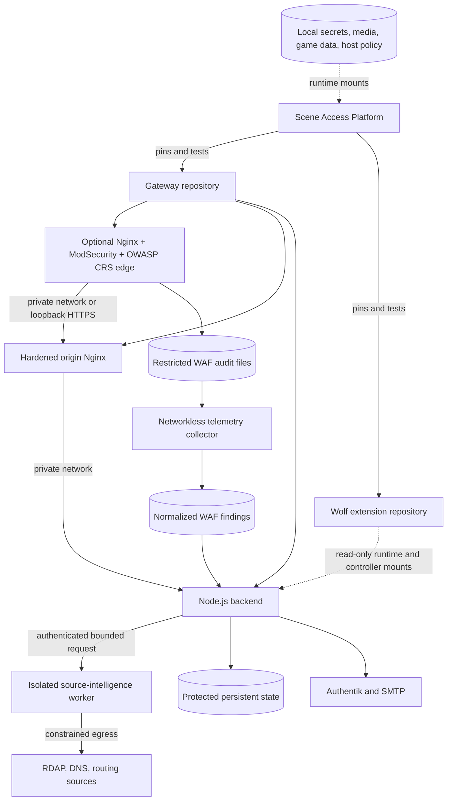

# Architecture

Scene Access Gateway is designed as a small container set with explicit trust
boundaries:

1. The selected frontend edge is the only public HTTP entrypoint. With the WAF
   enabled, it precedes a separate private or loopback-only origin gateway.
2. The backend is reachable only on the private Compose network.
3. Authentik remains the identity authority; the backend receives only the
   narrowly scoped credentials required for approved operations.
4. PostgreSQL and Authentik worker services are private infrastructure.
5. Scene state and secrets are mounted at runtime and are not image content.
6. Optional game integrations attach through a versioned extension contract.

The portable source retains the deployed application's behavior while keeping
production topology and optional GPL game code outside the core image. The
main repository is independently buildable; cross-repository CI also verifies
the read-only Wolf extension overlay against it.

## Repository and runtime topology

The Platform repository coordinates versions and Compose lifecycle. It does
not copy Gateway source. Gateway stays independently buildable when the Wolf
overlay is absent.

## Why the boundaries exist

| Component | Purpose | Trust boundary |
| --- | --- | --- |
| OWASP CRS WAF | Combines Nginx, ModSecurity 3.0.16, and CRS 4.29.0; terminates public TLS, rejects unknown hosts, replaces forwarding identity, inspects transactions, and writes restricted audits | The only internet-facing component when the optional WAF is enabled |
| Origin Nginx gateway | Owns application routing, authentication boundaries, browser security policy, and approved private-service relays | Private network or loopback-only public-origin listener behind the WAF; portable deployments may expose this layer directly |
| Portal backend | Owns short-lived challenges, rate limits, email confirmation, sessions, assertions, and scene behavior | Private Compose network; never publish its port directly |
| Scene Management | Authors scenes, reviews access requests, manages destinations, and reads the security ledger | Separate authenticated listener; not a public administration route |
| Authentik | Canonical identity, group membership, login policy, and identity audit events | Management API and credentials stay private and narrowly scoped |
| SMTP | Delivers one-time confirmation and registration links | Receives only the intended address and expiring link |
| Security ledger | Correlates application outcomes with source IP and optional offline GeoIP/ASN context | Protected state volume with bounded retention; never web-accessible directly |
| Destination proxy | Converts a valid portal session into a short-lived signed identity assertion before relaying | Upstream services remain private and receive only approved traffic |
| Source-intelligence worker | Performs bounded passive RDAP, reverse-DNS, and routing lookups for an operator-selected source | Unexposed service with no portal-state mount; authenticated requests only; active mode off by default |
| Application contract | Declares route/host, origin variables, identity, QR, proxy, CSP, WAF, and verification requirements | CI rejects incomplete, wildcard, or undocumented exceptions before target overlays are promoted |
| Optional extensions | Adds independently licensed experiences through a versioned read-only mount | Cannot make the public core depend on proprietary datasets |

## WAF request flow

Nginx, ModSecurity, and CRS are three parts of one WAF container rather than
three WAF services. Nginx owns TLS and reverse proxying. ModSecurity is the HTTP
inspection engine embedded in that Nginx process. CRS is the versioned rule set
executed by ModSecurity.

In the hardened shared-network-namespace pattern, the WAF owns the published
TLS port and the origin Nginx binds its corresponding listener only to
loopback. Accepted requests flow `client → WAF → loopback origin → backend or
approved destination`; responses return through the same layers. The two Nginx
processes remain separate containers so their configuration, health, logging,
and certificate reload lifecycles are independently constrained.

The tracked baseline uses `DetectionOnly`, blocking paranoia level 1,
detection paranoia level 2, and anomaly thresholds 5/4. Detection-only affects
CRS anomaly enforcement; Nginx hostname rejection and origin isolation remain
enforced. Promote rules to blocking only after observing representative
traffic and reviewing false positives.

## Four related audit streams

The system intentionally does not pretend that one log can see everything:

1. The WAF records CRS matches and edge request metadata without request
   headers, credentials, bodies, response bodies, or uploaded files.
2. The origin gateway observes connections, status codes, and requests rejected
   before application routing.
3. The portal security ledger understands QR, email, access-request, session,
   relay, and scene-management outcomes.
4. Authentik records identity, failed-login, invitation, group, and
   administrative events.

The WAF collector joins the ModSecurity audit and a minimal Nginx edge-access
record on their shared request ID, then collapses correlation rules and
multiple CRS messages from one transaction into a single normalized finding. It strips query values,
headers, bodies, cookies, authorization values, and uploads before the backend
re-signs the event into its integrity-protected ledger. The collector has no
network or Telegram credentials. Scene Management owns observation and alert
policy; WAF enforcement remains a reviewed deployment setting.

Correlating these streams provides better evidence than copying raw request
bodies into an application database. See [security monitoring](../security-monitoring.md)
for retention, trusted-client-IP, GeoIP, and alerting guidance. Normalized WAF
findings can become deduplicated Telegram incidents without exposing raw audit
content.

ModSecurity's JSON audit response code is evidence from the audit stream, not
automatically the final edge response. The normalized record carries that
provenance, and the UI and Telegram label it `WAF audit HTTP`. An actual WAF
interruption is status-verified as `waf_blocked`. The configured default virtual
host is another deterministic final outcome: numeric-host traffic matching CRS
920350 is returned as Edge HTTP 444 before proxying and is marked
`edge_rejected`, with origin reachability explicitly false. Other
non-interrupted findings remain unverified until they are correlated with the
origin/edge access log. This keeps WAF detection, edge enforcement, and
application reachability as separate architectural facts. A late access record
is appended as an integrity-protected outcome correction and folded into its
original finding at read time; it is not shown as a second event and does not
generate a second Telegram alert.
